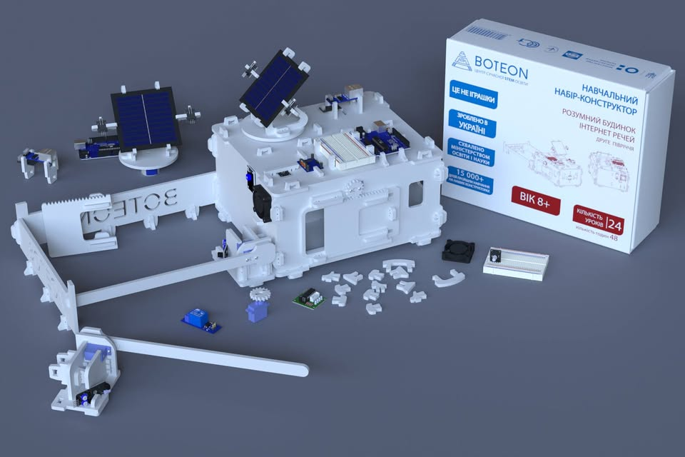

# L1 Incubation
### LeveL 1: Smart Technology & Robotics incubation
- **STEM Fundamentals** - Mechanics, electricity, magnetism, optics - core principles for robotics.
- **AI & IoT Integration** - Smart environments, computer vision, and real-time automation.
- **Digital Labs** - Alternative energy, biomedical electronics, cybersecurity, hands-on learning.
- **Robot factory** - Unique classroom based open development hub for prototyping, small-scale production, and real-world applications.

