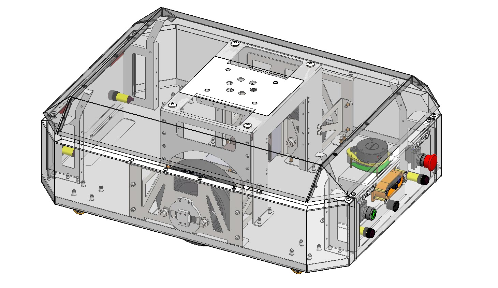

# L2 Acceleration
### Level 2:Robotics and AI acceleration
- **Master AI & Robotics Fundamentals** – Path planning, embedded systems, computer vision, deep learning.  
- **Build & Test Real-World Automation Projects** – Warehouse robotics, autonomous navigation.  
- **Develop Business & Entrepreneurship Skills** – Commercializing robotics solutions, RaaS models.  
- **Work on Industry-Specific Applications** – E-commerce fulfillment, last-mile delivery, AI logistics.

